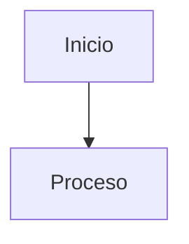

# PALTON

1. Lecturas

* [ ] Primera tarea
* [ ] Segunda tarea

Gorgias: Retorica -  la justicia
Fedon: Imortalidad del alma - Teoria -> preparacion para la muerte==sadas==
Gorgias: Ecomio de helena

Leer un poco de heraclito y parminides



\[^1]

\[^1]: Escribe la nota al pie aquí.

}

***

***

* Primera tarea
* Segunda tarea

```
```

buen oesto seria un ejemplo de notas de clase donde veo que es muchsisismo mas util escribir de esta manera