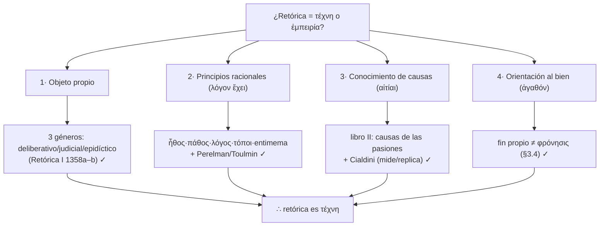
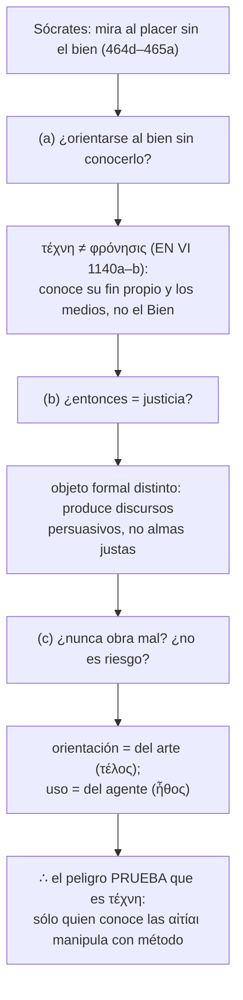

# Mapas del argumento

## 1 · Verificación de los cuatro criterios de τέχνη

```mermaid
graph TD
  T["¿Retórica = τέχνη o ἐμπειρία?"] --> C1["1· Objeto propio"]
  T --> C2["2· Principios racionales (λόγον ἔχει)"]
  T --> C3["3· Conocimiento de causas (αἰτίαι)"]
  T --> C4["4· Orientación al bien (ἀγαθόν)"]
  C1 --> C1a["3 géneros: deliberativo/judicial/epidíctico<br/>(Retórica I 1358a–b) ✓"]
  C2 --> C2a["ἦθος·πάθος·λόγος·τόποι·entimema<br/>+ Perelman/Toulmin ✓"]
  C3 --> C3a["libro II: causas de las pasiones<br/>+ Cialdini (mide/replica) ✓"]
  C4 --> C4a["fin propio ≠ φρόνησις (§3.4) ✓"]
  C1a --> V["∴ retórica es τέχνη"]
  C2a --> V
  C3a --> V
  C4a --> V
```

## 2 · La cadena de §3.4 (orientación al bien)

```mermaid
graph TD
  Q["Sócrates: mira al placer sin el bien (464d–465a)"]
  Q --> A["(a) ¿orientarse al bien sin conocerlo?"]
  A --> A1["τέχνη ≠ φρόνησις (EN VI 1140a–b):<br/>conoce su fin propio y los medios, no el Bien"]
  A1 --> B["(b) ¿entonces = justicia?"]
  B --> B1["objeto formal distinto: produce discursos<br/>persuasivos, no almas justas"]
  B1 --> C["(c) ¿nunca obra mal? ¿no es riesgo?"]
  C --> C1["orientación = del arte (τέλος);<br/>uso = del agente (ἦθος)"]
  C1 --> R["∴ el peligro PRUEBA que es τέχνη:<br/>sólo quien conoce las αἰτίαι manipula con método"]
```
