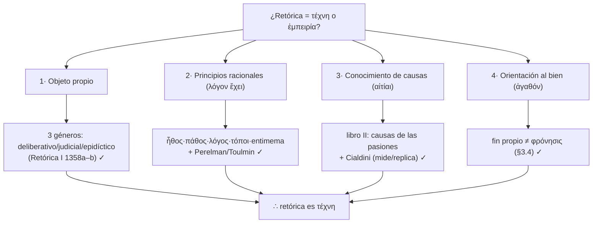
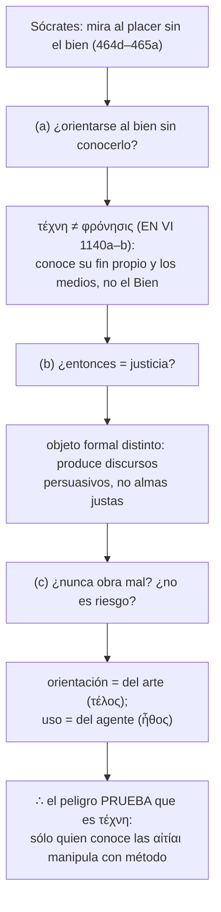

# Elevar el nivel del proyecto *Gorgias* — Plan de implementación

> **For agentic workers:** REQUIRED SUB-SKILL: Use superpowers:subagent-driven-development (recommended) or superpowers:executing-plans to implement this plan task-by-task. Steps use checkbox (`- [ ]`) syntax for tracking.

**Goal:** Añadir una capa extendida (`docs/`) y un build auto-verificable (`scripts/` + `Makefile`) que suban el nivel del proyecto, dejando el ensayo como núcleo esbelto y auto-contenido.

**Architecture:** El ensayo (`ensayo/Ensayo_Final.md`/`.docx`) es el núcleo entregable. `docs/` guarda rigor formal (notación legible), aparato erudito y mapas mermaid — supplementary, nunca requerido. `scripts/` + `Makefile` regeneran el `.docx` y validan las citas del ensayo contra `fuente/`.

**Tech Stack:** Python 3.12 (stdlib + `python-docx` en venv), Make, Markdown, Mermaid.

## Global Constraints

- **Invariante de auto-contención:** spec §3. El ensayo no depende de `docs/` ni de rutas externas.
- **Notación legible** (∀ ∃ → ¬ ∧ ↔ con prosa); **sin** proof-checkers/CI. (spec §2, decisión del usuario)
- **No** añadir autores teóricos nuevos al ensayo graduado; Dodds/Guthrie son *aparato*, con marca `⚠️ VERIFICAR` y sólo 1–2 apoyos seguros pueden tocar el cuerpo. (spec §5.2)
- Ejecutar desde la **raíz del repo**; rama `elevar-ensayo-gorgias`.
- Edición del ensayo: spec §5.5 (Opus, sin delegación). Reparto de modelos: spec §6.
- Todo texto en español; citas Stephanus `\b\d{3}[a-e]\b`, Bekker `1354a`… .

---

### Task 1: Esqueleto de build (`Makefile` + venv/deps)

**Files:**
- Create: `Makefile`
- Create: `requirements.txt`
- Create: `scripts/.gitkeep` (temporal)
- Modify: `.gitignore` (añadir `.venv/`)

**Interfaces:**
- Produces: targets `make verify`, `make docx`, `make wordcount`, `make all`; venv en `.venv/` con `python-docx`.

- [ ] **Step 1: Crear `requirements.txt`**
```
python-docx>=1.1.0
```

- [ ] **Step 2: Añadir `.venv/` a `.gitignore`**
Contenido a añadir (una línea):
```
.venv/
```

- [ ] **Step 3: Crear `Makefile`**
```makefile
PY := .venv/bin/python
ESSAY := ensayo/Ensayo_Final.md

.PHONY: all verify docx wordcount venv clean
venv:
	@test -d .venv || python3 -m venv .venv
	@.venv/bin/pip install -q -r requirements.txt

verify: venv
	@$(PY) scripts/verify_citations.py

docx: venv
	@$(PY) scripts/md2docx.py

wordcount:
	@awk '/^## Bibliografía/{exit} {print}' $(ESSAY) | wc -w | \
	  xargs -I{} echo "cuerpo: {} palabras (presupuesto 2200-2800)"

all: verify wordcount docx
	@echo "OK: verify + wordcount + docx"

clean:
	@rm -rf .venv
```

- [ ] **Step 4: Verificar `make wordcount`**
Run: `make wordcount`
Expected: imprime `cuerpo: 2929 palabras (presupuesto 2200-2800)` (o el valor vigente).

- [ ] **Step 5: Commit**
```bash
git add Makefile requirements.txt .gitignore scripts/.gitkeep
git commit -m "build: Makefile + venv (verify/docx/wordcount/all)"
```

---

### Task 2: Conversor `scripts/md2docx.py`

**Files:**
- Create: `scripts/md2docx.py`
- Delete: `scripts/.gitkeep`

**Interfaces:**
- Consumes: `ensayo/Ensayo_Final.md`. Produces: `ensayo/Ensayo_Final.docx` (invocado por `make docx`).

- [ ] **Step 1: Crear `scripts/md2docx.py`**
```python
#!/usr/bin/env python3
"""Ensayo_Final.md -> .docx con formato académico (TNR 12, justificado,
griego + negritas/cursivas). Ejecutar desde la raíz del repo."""
import re
from docx import Document
from docx.shared import Pt, Cm
from docx.enum.text import WD_ALIGN_PARAGRAPH, WD_LINE_SPACING

SRC = "ensayo/Ensayo_Final.md"
OUT = "ensayo/Ensayo_Final.docx"

doc = Document()
normal = doc.styles["Normal"]
normal.font.name = "Times New Roman"
normal.font.size = Pt(12)
pf = normal.paragraph_format
pf.line_spacing_rule = WD_LINE_SPACING.SINGLE
pf.space_after = Pt(6)
pf.alignment = WD_ALIGN_PARAGRAPH.JUSTIFY
for section in doc.sections:
    section.top_margin = Cm(2.5); section.bottom_margin = Cm(2.5)
    section.left_margin = Cm(3); section.right_margin = Cm(3)

INLINE = re.compile(r"(\*\*.+?\*\*|\*.+?\*)")

def add_runs(paragraph, text, base_bold=False, size=None):
    pos = 0
    def sty(r):
        if base_bold: r.bold = True
        if size: r.font.size = Pt(size)
    for m in INLINE.finditer(text):
        if m.start() > pos: sty(paragraph.add_run(text[pos:m.start()]))
        tok = m.group(0)
        if tok.startswith("**"):
            r = paragraph.add_run(tok[2:-2]); r.bold = True
            if size: r.font.size = Pt(size)
        else:
            r = paragraph.add_run(tok[1:-1]); r.italic = True
            if base_bold: r.bold = True
            if size: r.font.size = Pt(size)
        pos = m.end()
    if pos < len(text): sty(paragraph.add_run(text[pos:]))

with open(SRC, encoding="utf-8") as fh:
    lines = fh.read().split("\n")

for raw in lines:
    s = raw.strip()
    if s == "" or s == "***": continue
    if s.startswith("# "):
        p = doc.add_paragraph(); p.alignment = WD_ALIGN_PARAGRAPH.CENTER
        p.paragraph_format.space_after = Pt(14); add_runs(p, s[2:], True, 14)
    elif s.startswith("### "):
        p = doc.add_paragraph(); p.paragraph_format.space_before = Pt(8)
        add_runs(p, s[4:], True, 12)
    elif s.startswith("## "):
        p = doc.add_paragraph(); p.paragraph_format.space_before = Pt(10)
        add_runs(p, s[3:], True, 13)
    elif s.startswith("* "):
        p = doc.add_paragraph()
        p.paragraph_format.left_indent = Cm(1)
        p.paragraph_format.first_line_indent = Cm(-1)
        p.paragraph_format.space_after = Pt(4); add_runs(p, s[2:])
    else:
        add_runs(doc.add_paragraph(), s)

doc.save(OUT)
print(f"OK -> {OUT}")
```

- [ ] **Step 2: Ejecutar `make docx`**
Run: `make docx`
Expected: `OK -> ensayo/Ensayo_Final.docx`

- [ ] **Step 3: Validar el docx (griego + runs)**
Run:
```bash
.venv/bin/python - <<'PY'
from docx import Document
t="\n".join(p.text for p in Document("ensayo/Ensayo_Final.docx").paragraphs)
assert "τέχνη" in t and "ἐμπειρία" in t, "falta griego"
print("docx OK, palabras:", len(t.split()))
PY
```
Expected: `docx OK, palabras: ~3030`

- [ ] **Step 4: Commit**
```bash
git rm scripts/.gitkeep
git add scripts/md2docx.py ensayo/Ensayo_Final.docx
git commit -m "build: conversor md->docx (make docx)"
```

---

### Task 3: Guardián de citas `scripts/verify_citations.py` (TDD)

**Files:**
- Create: `scripts/verify_citations.py`
- Create: `tests/test_verify_citations.py`
- Create: `tests/fixtures/mini_essay.md`, `tests/fixtures/mini_source.md`

**Interfaces:**
- Produces: función `check(essay_path, source_glob) -> (fails:int, rows:list)` y CLI `verify_citations.py [essay] [source_glob]`; sale `!=0` si alguna cita literal **con referencia Stephanus** no aparece en `fuente/`. Consumido por `make verify`.
- `flatten(s)->str`: minúsculas, sin acentos, solo `[a-z0-9]` (robusto a OCR con espacios intra-palabra).

- [ ] **Step 1: Escribir el test que falla**
```python
# tests/test_verify_citations.py
import subprocess, sys, os, textwrap, pathlib
ROOT = pathlib.Path(__file__).resolve().parents[1]
def run(essay, src):
    return subprocess.run([sys.executable, str(ROOT/"scripts/verify_citations.py"), essay, src],
                          capture_output=True, text=True)
def test_matching_quote_passes(tmp_path):
    (tmp_path/"src.md").write_text("...la retorica es el simulacro de una parte de la politica...", encoding="utf-8")
    (tmp_path/"essay.md").write_text("es «un simulacro de una parte de la política» (463d).", encoding="utf-8")
    r = run(str(tmp_path/"essay.md"), str(tmp_path/"src.md"))
    assert r.returncode == 0, r.stdout
def test_referenced_quote_not_in_source_fails(tmp_path):
    (tmp_path/"src.md").write_text("texto que no contiene la cita", encoding="utf-8")
    (tmp_path/"essay.md").write_text("Sócrates dice «esto es una invención total del autor» (999z? 465a).", encoding="utf-8")
    r = run(str(tmp_path/"essay.md"), str(tmp_path/"src.md"))
    assert r.returncode != 0, r.stdout
def test_gloss_without_ref_does_not_fail(tmp_path):
    (tmp_path/"src.md").write_text("nada relacionado", encoding="utf-8")
    (tmp_path/"essay.md").write_text("mi propia glosa «la justicia, medicina del alma» sin referencia.", encoding="utf-8")
    r = run(str(tmp_path/"essay.md"), str(tmp_path/"src.md"))
    assert r.returncode == 0, r.stdout
```

- [ ] **Step 2: Correr y ver que falla**
Run: `.venv/bin/pip -q install pytest && .venv/bin/python -m pytest tests/test_verify_citations.py -q`
Expected: FAIL (`verify_citations.py` no existe).

- [ ] **Step 3: Implementar `scripts/verify_citations.py`**
```python
#!/usr/bin/env python3
"""Valida las citas literales del ensayo contra el texto fuente del Gorgias.
Regla dura: toda cita «...» seguida (dentro de ~30 chars) de una referencia
Stephanus DEBE aparecer en fuente/ (matching sin acentos ni espacios, robusto
a OCR). Glosas sin referencia -> informativas, no fallan. Bekker -> no verificable.
Uso: verify_citations.py [essay.md] [source_glob]"""
import re, sys, glob, unicodedata

def flatten(s):
    s = s.lower().replace("[...]", " ")
    s = unicodedata.normalize("NFD", s)
    s = "".join(c for c in s if unicodedata.category(c) != "Mn")
    return re.sub(r"[^a-z0-9]", "", s)

STEPH = re.compile(r"\b\d{3}[a-e]\b")

def found(qflat, srcflat):
    if len(qflat) < 8:
        return True  # demasiado corto para afirmar/negar
    if qflat in srcflat:
        return True
    win = min(len(qflat), 24)
    for i in range(0, len(qflat) - win + 1):
        if qflat[i:i+win] in srcflat:
            return True
    return False

def check(essay_path, source_glob):
    essay = open(essay_path, encoding="utf-8").read()
    src = ""
    for p in glob.glob(source_glob):
        src += "\n" + open(p, encoding="utf-8").read()
    srcflat = flatten(src)
    rows, fails = [], 0
    for m in re.finditer(r"«(.+?)»", essay, flags=re.S):
        q = m.group(1).strip()
        tail = essay[m.end():m.end()+30]
        referenced = bool(STEPH.search(tail))
        ok = found(flatten(q), srcflat)
        status = "OK" if ok else ("FALLA" if referenced else "info(glosa)")
        if referenced and not ok:
            fails += 1
        rows.append((status, referenced, q[:70]))
    return fails, rows

def main():
    essay = sys.argv[1] if len(sys.argv) > 1 else "ensayo/Ensayo_Final.md"
    srcg = sys.argv[2] if len(sys.argv) > 2 else "fuente/*.md"
    fails, rows = check(essay, srcg)
    print("== Citas «...» del ensayo vs fuente ==")
    for status, ref, q in rows:
        tag = "[ref]" if ref else "[   ]"
        print(f"  {status:11} {tag} «{q}»")
    bekker = sorted(set(re.findall(r"\b1[0-4]\d{2}[ab]\b", open(essay, encoding='utf-8').read())))
    if bekker:
        print("\n== Bekker (Aristóteles) — no verificable (sin fuente en repo) ==")
        print("  " + ", ".join(bekker))
    print(f"\nResultado: {fails} cita(s) referenciada(s) sin coincidencia en fuente.")
    sys.exit(1 if fails else 0)

if __name__ == "__main__":
    main()
```

- [ ] **Step 4: Correr los tests hasta verde**
Run: `.venv/bin/python -m pytest tests/test_verify_citations.py -q`
Expected: PASS (3 passed).

- [ ] **Step 5: Correr el guardián sobre el ensayo real**
Run: `make verify`
Expected: todas las citas con `[ref]` en `OK`; `Resultado: 0 cita(s)...`; exit 0.
*(Si algo diera FALLA por OCR, ampliar la ventana `win` o normalización — no relajar la regla.)*

- [ ] **Step 6: Commit**
```bash
git add scripts/verify_citations.py tests/
git commit -m "build: verify_citations guardián de citas Stephanus (make verify)"
```

---

### Task 4: Capa formal `docs/formal/derivaciones.md`

**Files:**
- Create: `docs/formal/derivaciones.md`

**Molde fijo por argumento:** **(i) enunciado natural · (ii) formalización · (iii) veredicto de validez · (iv) nexo con §/pasaje del ensayo.** Notación legible; una línea por premisa. Cabecera del archivo que declare el invariante ("apéndice; el ensayo no depende de esto").

- [ ] **Step 1: Crear `docs/formal/derivaciones.md` con molde (i)–(iv)**
Seguir spec §5.1: (i) enunciado natural · (ii) formalización · (iii) veredicto · (iv) nexo con § ensayo.
Incluir A1–A5 (referencia canónica con ejemplos trabajados: reproducción exacta en `docs/formal/derivaciones.md`).

- [ ] **Step 2: Aceptación**
Revisar que el archivo: tiene cabecera con el invariante, cubre A1–A5 con el molde (i)–(iv), no referencia rutas que el ensayo necesite. (Delegable a modelo capaz; Opus valida.)

- [ ] **Step 3: Commit**
```bash
git add docs/formal/derivaciones.md
git commit -m "docs(formal): refutaciones del Gorgias en notación legible (A1-A5)"
```

---

### Task 5: Aparato erudito `docs/aparato/dodds-guthrie.md`

**Files:**
- Create: `docs/aparato/dodds-guthrie.md`

**Contenido (cada punto con `⚠️ VERIFICAR contra copia física`):**
- **Dodds**, *Plato: Gorgias* (OUP 1959): lema *ad* 462b–466a (cocina/medicina, κολακεία), *ad* 465a ("no puede decir la causa"), *ad* 500b–501c (τέχνη vs ἐμπειρία). Cómo cada lema apoya la lectura del ensayo.
- **Guthrie**, *HGP* IV (CUP 1975): contexto sofístico; lugar del *Gorgias*; retórica y poder.
- **Fedro 271c–277a** ampliado: la retórica dialéctica que Platón mismo concede → la censura del *Gorgias* recae sobre un *uso*.
- Cierre: qué 1–2 apoyos (los más estándar) podrían promoverse al ensayo y cuáles NO (por riesgo de cita sin fuente).

- [ ] **Step 1: Redactar el archivo** con la estructura anterior; cada afirmación factual marcada `⚠️ VERIFICAR`. (Delegable a Gemini; Opus valida el encuadre.)
- [ ] **Step 2: Aceptación** — ninguna afirmación de Dodds/Guthrie sin marca `⚠️ VERIFICAR`; nada de esto es requerido por el ensayo.
- [ ] **Step 3: Commit**
```bash
git add docs/aparato/dodds-guthrie.md
git commit -m "docs(aparato): Dodds, Guthrie y nota Fedro (con marca VERIFICAR)"
```

---

### Task 6: Mapas `docs/mapas/argumento.md`

**Files:**
- Create: `docs/mapas/argumento.md`

- [ ] **Step 1: Crear el archivo con dos diagramas mermaid**
````markdown
# Mapas del argumento

## 1 · Verificación de los cuatro criterios de τέχνη


## 2 · La cadena de §3.4 (orientación al bien)

````

- [ ] **Step 2: Aceptación** — sintaxis mermaid bien formada (dos bloques ```` ```mermaid ````), sin dependencias externas.
- [ ] **Step 3: Commit**
```bash
git add docs/mapas/argumento.md
git commit -m "docs(mapas): diagramas mermaid (4 criterios + cadena §3.4)"
```

---

### Task 7: Índice de la capa `docs/README.md`

**Files:**
- Create: `docs/README.md`

- [ ] **Step 1: Crear `docs/README.md`**
```markdown
# Capa extendida (`docs/`)

> Material **supplementary**. El ensayo (`../ensayo/Ensayo_Final.md`) se sostiene
> solo; borrar esta carpeta no lo rompe.

- `formal/derivaciones.md` — refutaciones del *Gorgias* en notación legible (A1–A5).
- `aparato/dodds-guthrie.md` — aparato erudito (Dodds, Guthrie) + nota *Fedro*. ⚠️ verificar contra copia física.
- `mapas/argumento.md` — diagramas del argumento (mermaid).

## Mapa ensayo → formal
| Sección del ensayo | Derivación |
|---|---|
| §1 refutación de Gorgias | A1 |
| §2 clasificación arbitraria | A2 |
| §3 verificación de criterios | A3 |
| §3.4c trampa simétrica / arte-agente | A4, A5 |
```

- [ ] **Step 2: Commit**
```bash
git add docs/README.md
git commit -m "docs: índice de la capa extendida + mapa ensayo→formal"
```

---

### Task 8: Toque mínimo al ensayo (§2) — **Opus, no delegar**

**Files:**
- Modify: `ensayo/Ensayo_Final.md` (§2, párrafo "Segundo, niega a la retórica principios racionales…")

**Invariante:** sólo prosa; **sin símbolos ni rutas** en el cuerpo (propiedad académica + auto-contención). Afinar el nombramiento del salto inválido.

- [ ] **Step 1: Editar la frase de §2** (afilar, no añadir dependencia)
Reemplazar: `es una falacia de composición.`
Por: `es una falacia de composición: de que *algún* orador persuada sin saber no se sigue nada sobre la retórica *como arte*.`

- [ ] **Step 2: Guardián verde tras el cambio**
Run: `make verify`
Expected: `Resultado: 0 cita(s)...`, exit 0.

- [ ] **Step 3: Regenerar docx + wordcount**
Run: `make docx && make wordcount`
Expected: docx OK; cuerpo dentro de rango informado.

- [ ] **Step 4: Commit**
```bash
git add ensayo/Ensayo_Final.md ensayo/Ensayo_Final.docx
git commit -m "essay(§2): afinar el nombramiento de la falacia de composición"
```

---

### Task 9: `README.md` raíz — arquitectura en capas

**Files:**
- Modify: `README.md` (nueva sección antes de `## Estado`)

- [ ] **Step 1: Insertar sección**
```markdown
## Arquitectura en capas
- **Núcleo (entregable):** `ensayo/Ensayo_Final.md` / `.docx` — se sostiene solo.
- **Capa extendida:** `docs/` (formal, aparato, mapas) — supplementary; no requerida por el ensayo.
- **Build:** `make verify` (valida citas Stephanus vs `fuente/`), `make docx` (regenera el `.docx`), `make wordcount`, `make all`.
```

- [ ] **Step 2: Commit**
```bash
git add README.md
git commit -m "docs: README documenta arquitectura en capas y make targets"
```

---

### Task 10: Cierre — `make all` verde + invariante

- [ ] **Step 1: `make all`**
Run: `make all`
Expected: verify 0 fallos, wordcount impreso, docx OK, `OK: verify + wordcount + docx`.

- [ ] **Step 2: Comprobar invariante (el ensayo no depende de `docs/`)**
Run:
```bash
grep -n "docs/" ensayo/Ensayo_Final.md || echo "OK: el ensayo no referencia docs/"
```
Expected: `OK: el ensayo no referencia docs/`

- [ ] **Step 3: Actualizar bitácora (v5) y commit final**
Añadir en `ensayo/Bitacora_Ensayo.md` una nota v5: capa `docs/` + build de verificación; invariante; targets `make`.
```bash
git add ensayo/Bitacora_Ensayo.md
git commit -m "docs(bitácora): registro v5 — capa extendida + build auto-verificable"
```

---

## Self-Review (cobertura del spec)
- spec §4 arquitectura → Tasks 1–7,9 ✓ · §5.1 formal → Task 4 ✓ · §5.2 aparato → Task 5 ✓ · §5.3 mapas → Task 6 ✓ · §5.4 build/scripts → Tasks 1–3 ✓ · §5.5 toque ensayo → Task 8 ✓ · §5.6 README → Task 9 ✓ · §8 criterios de aceptación → Task 10 + `make verify`/`make docx` ✓.
- Sin placeholders: código completo en scripts/Makefile/mermaid; molde + formalizaciones exactas para prosa.
- Consistencia de nombres: `verify`, `docx`, `wordcount`, `all`; `check()`, `flatten()`, `found()` usados igual en script y tests.
