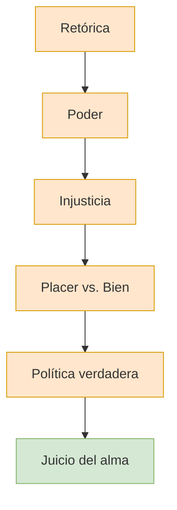

# 01 — Visión General del Gorgias

> Panorama completo del diálogo: contexto histórico, estructura dramática, personajes, tesis central y relevancia filosófica.

***

## 🏛️ Contexto histórico

El *Gorgias* fue escrito por Platón aproximadamente entre el **390 y el 385 a.C.**, pocos años después de la muerte de Sócrates (399 a.C.). Pertenece al grupo de los llamados **diálogos de juventud** o **diálogos socráticos**, aunque por su extensión, complejidad argumentativa y profundidad temática muchos especialistas lo sitúan como un **diálogo de transición** hacia el período medio.

### Atenas en el siglo V–IV a.C.

* La **democracia ateniense** estaba en crisis tras la derrota en la Guerra del Peloponeso (404 a.C.).
* Los **sofistas** y **retóricos** dominaban la educación de las élites. Enseñaban a persuadir en la Asamblea y en los tribunales, cobrando por sus servicios.
* La retórica era la herramienta del poder político: quien dominaba la palabra dominaba la ciudad.
* La condena de Sócrates estaba fresca en la memoria ateniense — y el *Gorgias* es, en parte, una respuesta filosófica a esa condena.

### El problema de fondo

El diálogo plantea una pregunta que atravesaba la vida ateniense: **¿qué tipo de educación necesitan los ciudadanos y los gobernantes?** La respuesta de los sofistas era "retórica" (persuasión eficaz). La respuesta de Platón, a través de Sócrates, será radicalmente distinta: "justicia y filosofía" (cuidado del alma).

***

## 🎭 Estructura dramática del diálogo

El *Gorgias* se despliega en **tres actos**, cada uno con un interlocutor distinto. La intensidad crece: Gorgias es el más dócil, Polo el más impulsivo, Calicles el más radical.

### Acto I — Gorgias (447a–461b): La definición de la retórica

* Sócrates llega tarde a una exhibición retórica de Gorgias.
* Quiere preguntarle *qué es* la retórica, no solo escuchar un discurso.
* Gorgias la define como el arte de la persuasión sobre lo justo y lo injusto.
* Sócrates fuerza la distinción entre **creencia** (*pistis*) y **conocimiento** (*epistéme*).
* Gorgias admite que el orador no necesita saber la verdad.
* Se siembra la semilla: la retórica no es un arte verdadero, sino **adulación**.

### Acto II — Polo (461b–481b): El poder y la injusticia

* Polo, discípulo joven de Gorgias, salta a defenderlo.
* Sostiene que los retóricos y tiranos tienen el mayor poder y son los más felices.
* Sócrates introduce la distinción entre **hacer lo que uno quiere** y **hacer lo que a uno le parece**.
* Invierte la tesis: **cometer injusticia es peor que sufrirla**.
* El castigo es la **medicina del alma**: el injusto castigado es más feliz que el injusto impune.

### Acto III — Calicles (481b–522e): Naturaleza, convención y placer

* Calicles, aristócrata ateniense, defiende la tesis más extrema.
* La naturaleza dicta que el más fuerte domine; la ley es un invento de los débiles.
* La vida buena es el placer y la ambición desmedida.
* Sócrates demuestra que **el placer no es lo mismo que el bien**.
* El alma ordenada (*sóphron*) es la única buena y feliz.
* La verdadera política es el **cuidado del alma** de los ciudadanos.

### Epílogo — El mito final (522e–527e)

* Calicles abandona el diálogo.
* Sócrates narra el mito del juicio de las almas en el Hades.
* Refuerza la tesis: lo temible no es la muerte, sino morir con el alma cargada de injusticias.

***

## 👥 Personajes principales

| Personaje      | Rol en el diálogo    | Posición filosófica                                                            | Carácter                                                       |
| -------------- | -------------------- | ------------------------------------------------------------------------------ | -------------------------------------------------------------- |
| **Sócrates**   | Protagonista         | La filosofía como cuidado del alma; la justicia como condición de la felicidad | Irónico, incisivo, dispuesto a sostener tesis contraintuitivas |
| **Gorgias**    | Primer interlocutor  | La retórica como arte de la persuasión                                         | Digno, respetuoso, atrapado en sus propias contradicciones     |
| **Polo**       | Segundo interlocutor | La retórica como fuente de poder absoluto                                      | Joven, impulsivo, admira el poder y el lujo                    |
| **Calicles**   | Tercer interlocutor  | La naturaleza como ley del más fuerte; hedonismo                               | Aristócrata ambicioso, desprecia la filosofía, el más sincero  |
| **Querefonte** | Personaje secundario | Amigo de Sócrates                                                              | Leal, hace preguntas iniciales a Gorgias                       |

***

## 🧭 Tesis central del diálogo

> **Cometer injusticia es el mayor de los males, peor que sufrirla. La política no es proveer placeres a la ciudad (naves, murallas), sino hacer mejores a los ciudadanos mediante la justicia. Solo el justo es verdaderamente feliz y poderoso. El que muere con el alma limpia no teme a la muerte; el que muere cargado de injusticias sufre el peor destino.**

***

## 🌊 Progresión temática

El diálogo avanza en espiral, no en línea recta. Cada interlocutor fuerza a Sócrates a profundizar:

1. **Con Gorgias:** ¿Qué es la retórica? → No es un arte, es adulación.
2. **Con Polo:** ¿Da poder la retórica? → El tirano no tiene verdadero poder.
3. **Con Calicles:** ¿Es la vida de placer la mejor? → El bien no es el placer; la virtud es el orden del alma.

***

## 💡 Relevancia filosófica

El *Gorgias* es uno de los diálogos más importantes de Platón por varias razones:

1. **Fundamentación de la ética:** Establece que la justicia no es una convención social sino un bien en sí mismo, ligado a la salud del alma.
2. **Crítica de la democracia ateniense:** Cuestiona el fundamento mismo del poder político basado en la persuasión y no en el conocimiento.
3. **Filosofía como forma de vida:** Sócrates aparece como el modelo del filósofo que prefiere sufrir injusticia antes que cometerla.
4. **Psicología moral:** Introduce la idea del alma como un todo ordenado (o desordenado) cuya salud depende de la justicia y la moderación.
5. **Anticipación de la República:** Muchos temas del *Gorgias* —la crítica a la retórica, la analogía cuerpo/alma, la política como cuidado del alma— se desarrollarán sistemáticamente en la *República*.

***

## 📝 Preguntas de repaso

1. ¿En qué contexto histórico y político fue escrito el *Gorgias*?
2. ¿Cuáles son los tres actos del diálogo y quién es el interlocutor de cada uno?
3. ¿Cuál es la tesis central del *Gorgias*?
4. ¿Por qué el diálogo avanza "en espiral" y no en línea recta?
5. ¿Qué personaje abandona el diálogo y qué simboliza ese abandono?

***

*Continúa en `02_gorgias_retórica_y_persuasión.md` para el análisis detallado del primer acto.*