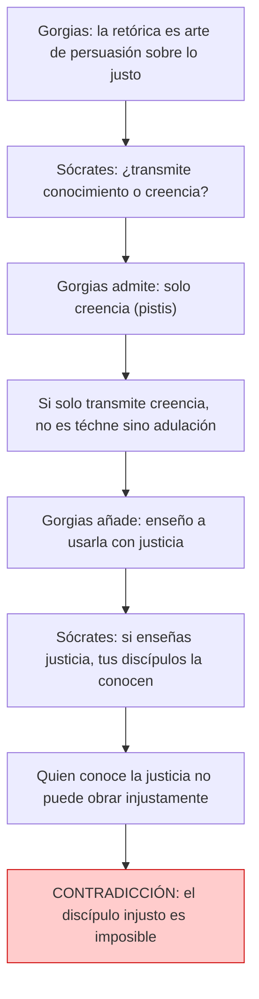

# 02 — Gorgias: Retórica y Persuasión

> Primer acto del diálogo (447a–461b): Sócrates interroga a Gorgias sobre la naturaleza de la retórica.
> Se establece la distinción fundamental entre conocimiento (*epistéme*) y creencia (*pistis*),
> y se revela la contradicción interna de Gorgias sobre la justicia.

---

## 🎬 Introducción: La llegada de Sócrates

El diálogo comienza con Sócrates y Querefonte llegando tarde a una exhibición retórica de Gorgias. Este detalle no es casual: Sócrates no quiere *escuchar* un discurso, quiere *preguntar* y *dialogar*. Frente a la retórica como espectáculo, la filosofía como interrogación.

**Contexto dramático:** Gorgias de Leontinos (c. 483–375 a.C.) fue uno de los sofistas más célebres del mundo griego. Su habilidad oratoria era legendaria. Platón lo presenta como un personaje digno, a diferencia de otros sofistas ridiculizados en otros diálogos.

---

## 🎯 Parte 1: ¿Qué es la retórica?

### La definición inicial de Gorgias

**Tesis de Gorgias:** La retórica es el arte (*téchne*) de la persuasión por medio de la palabra, y su objeto específico es persuadir sobre lo justo y lo injusto, especialmente en los tribunales y en las asambleas.

Gorgias sostiene que la retórica es el mayor de los bienes humanos porque permite:
- Persuadir a jueces y asambleas
- Convencer sin necesidad de conocimiento técnico
- Obtener poder sin ser experto en cada materia

### La distinción socrática fundamental

Sócrates fuerza a Gorgias a distinguir entre **dos tipos de persuasión**:

| Tipo de persuasión | Produce | Fundamento | Ejemplo |
|---|---|---|---|
| **Creencia sin conocimiento** (*pistis*) | Convicción sin saber | Apariencia, emoción, opinión | El orador ante un público lego |
| **Conocimiento genuino** (*epistéme*) | Saber fundamentado | Razón, demostración, verdad | El matemático que enseña geometría |

**La pregunta clave:** ¿La retórica transmite conocimiento sobre la justicia, o solo creencia?

---

### El golpe de Sócrates

Sócrates lleva a Gorgias a admitir que:

1. El orador **no necesita saber la verdad** sobre aquello de lo que habla.
2. Basta con que **parezca saber** ante un público que tampoco sabe.
3. Por tanto, la retórica persuade sin conocimiento.

**Conclusión parcial:** Si la retórica persuade sin conocimiento, **no es un arte verdadero (*téchne*) sino una práctica de adulación (*kolakeía*)**.

Esto es devastador: Gorgias mismo ha concedido que su "arte" no requiere conocer la verdad de aquello sobre lo que persuade. La retórica queda reducida a una técnica de manipulación de la opinión.

---

## 🎯 Parte 2: La retórica y la justicia

### La contradicción de Gorgias

Aquí ocurre un giro dramático. Después de admitir que el orador puede persuadir sin saber, Gorgias añade — quizás por vergüenza ante el público, quizás por convicción genuina — que:

> **Él, como maestro, enseña a sus discípulos a usar la retórica con justicia**, y que si algún discípulo la usa injustamente, el maestro no es responsable.

### El contraataque socrático

Sócrates detecta una inconsistencia lógica demoledora. Reconstruyamos el argumento:

**Paso 1 — El principio socrático:**
> Quien conoce la justicia es justo y obra justamente.
> (Nadie que verdaderamente sepa qué es la justicia puede obrar contra ella, del mismo modo que nadie que sepa matemáticas puede equivocarse en una suma por ignorancia.)

**Paso 2 — La enseñanza de Gorgias:**
> Gorgias enseña retórica, y la retórica trata sobre lo justo y lo injusto.
> Por tanto, sus discípulos deberían conocer la justicia.

**Paso 3 — La conclusión devastadora:**
> Si conocen la justicia, **no pueden obrar injustamente**.
> Por tanto, la excusa de "el discípulo usó mal lo aprendido" es **lógicamente imposible**.

**Resultado:** Gorgias queda refutado pero sin humillación. Platón lo presenta como un personaje digno, atrapado en sus propias premisas. Su silencio es elocuente: no puede responder sin contradecirse aún más.

---

## 🔑 Conceptos clave de esta sección

| Concepto griego | Traducción | Definición en el diálogo |
|---|---|---|
| **Téchne** (τέχνη) | Arte, técnica | Saber que conoce la naturaleza de su objeto y puede dar razón (*lógon didónai*) de lo que hace |
| **Pistis** (πίστις) | Creencia, fe | Persuasión que no se funda en el conocimiento de la verdad |
| **Epistéme** (ἐπιστήμη) | Conocimiento, ciencia | Saber fundamentado, capaz de dar cuenta racional de sí mismo |
| **Kolakeía** (κολακεία) | Adulación | Práctica que simula ser un arte pero solo busca lo agradable, no lo bueno |
| **Élenchos** (ἔλεγχος) | Refutación | Método socrático: mostrar que las creencias del interlocutor se contradicen entre sí |
| **Lógon didónai** (λόγον διδόναι) | Dar razón | Capacidad de justificar racionalmente lo que se afirma, característica del verdadero conocimiento |

---

## 🧠 Explicación filosófica profunda

### ¿Por qué la retórica no es una téchne?

La clave está en el criterio socrático del arte verdadero:

1. **Una téchne conoce la naturaleza (*phýsis*) de su objeto.** Sabe qué es aquello sobre lo que opera.
2. **Una téchne conoce la causa (*aitía*) de lo que produce.** Puede explicar por qué hace lo que hace.
3. **Una téchne apunta al bien (*agathón*) de su objeto.** La medicina busca la salud del cuerpo; la justicia, la salud del alma.

La retórica, según Sócrates, no cumple ninguno de estos criterios:
- No conoce la naturaleza de la justicia (no necesita saber qué es).
- No puede dar razón de por qué persuade (solo sabe *que* persuade).
- No apunta al bien del alma (solo busca agradar al auditorio).

### Persuasión sin conocimiento: el problema de la democracia

Este argumento tiene una dimensión política inmediata. Si la Asamblea ateniense se dejaba persuadir por oradores que no sabían de lo que hablaban — estrategia militar, finanzas públicas, justicia —, entonces la democracia ateniense estaba gobernada por la **opinión** y no por el **conocimiento**.

He aquí una de las críticas más profundas a la democracia directa: cuando las decisiones se toman por persuasión y no por conocimiento, la ciudad se vuelve ingobernable.

---

## 📊 Esquema del argumento contra Gorgias

---

## 📖 Citas clave (paráfrasis)

- **Sócrates:** «¿La retórica es el arte de producir persuasión que enseña a creer sin saber, o la que enseña a saber?» (cf. 454e)
- **Gorgias:** «El orador no necesita saber la verdad; basta con que parezca saber ante quienes no saben.» (cf. 459b–c)
- **Sócrates:** «Si la retórica es adulación, entonces es a la justicia lo que la cocina a la medicina: una simulación de lo que cuida el alma.» (cf. 465c)

---

## 📝 Conclusión parcial

El primer acto del *Gorgias* establece el terreno conceptual de todo el diálogo:

1. La retórica, tal como la practican los sofistas, **no es un arte** sino una práctica de adulación.
2. Persuade sin conocimiento, produciendo **creencia** y no saber.
3. Quien conoce la justicia **no puede obrar injustamente** — principio que recorre todo el diálogo.
4. Gorgias, atrapado en sus propias premisas, queda refutado pero mantiene su dignidad.

---

## ❓ Preguntas de repaso

1. ¿Qué dos tipos de persuasión distingue Sócrates?
2. ¿Por qué la retórica no puede ser una *téchne* según los criterios socráticos?
3. ¿Cuál es la contradicción en la que cae Gorgias al hablar de la enseñanza de la justicia?
4. ¿Qué implicaciones políticas tiene afirmar que la retórica persuade sin conocimiento?
5. ¿Qué diferencia hay entre *pistis* y *epistéme*? Da un ejemplo de cada una.

---

*Continúa en `03_polo_poder_injusticia_y_castigo.md` para el segundo acto.*
