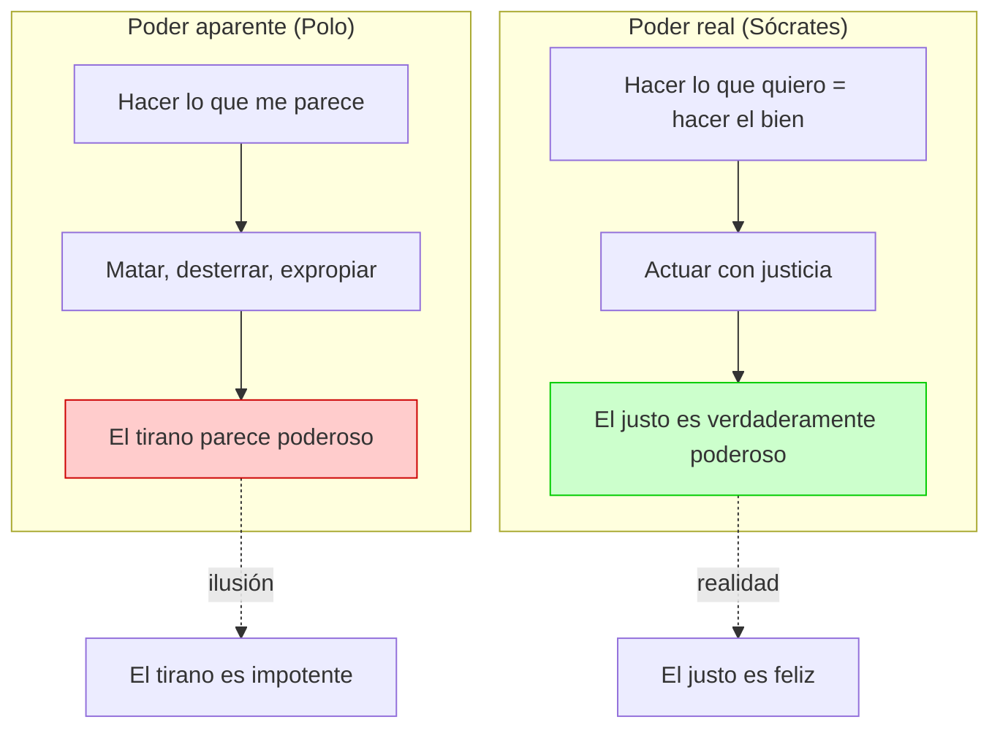
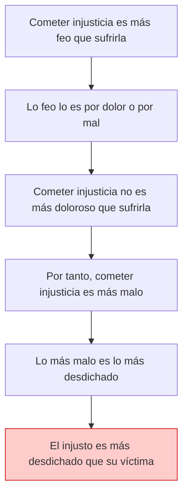

# 03 — Polo: Poder, Injusticia y Castigo

> Segundo acto del diálogo (461b–481b): Sócrates vs. Polo.
> Se demuestra que el tirano no tiene verdadero poder, que cometer injusticia es peor que sufrirla,
> y que el castigo es la medicina del alma.

---

## 🎬 Introducción: La irrupción de Polo

Tras la refutación de Gorgias, **Polo**, su joven discípulo, salta a defenderlo. Polo es impulsivo, impaciente y admira abiertamente el poder y el lujo. No le interesa la verdad filosófica: quiere *ganar* el debate.

Frente a la dignidad contenida de Gorgias, Polo representa la **ambición juvenil** que ve en la retórica un atajo hacia el poder. Es el tipo de ateniense que Platón considera peligroso: inteligente pero sin escrúpulos.

---

## 🎯 Parte 1: El poder del retórico y del tirano

### La tesis de Polo

**Polo sostiene que:** Los retóricos y los tiranos tienen el mayor poder (*dýnamis*) en la ciudad, y por tanto son los más felices.

Su argumento es simple:
- El orador puede desterrar, matar y expropiar a quien quiera.
- El tirano (como **Arquelao de Macedonia**) puede cometer los peores crímenes y aún así alcanzar el poder supremo.
- Tener poder = poder hacer lo que a uno le parezca.

Polo cita el caso de **Arquelao**, tirano de Macedonia, que:
- Era hijo ilegítimo de Pérdicas II.
- Asesinó a su tío, a su primo (heredero legítimo) y a su hermano menor.
- A pesar de sus crímenes, gobernó Macedonia con éxito.

Para Polo, Arquelao es la prueba viviente de que **el injusto puede ser feliz** si tiene poder.

---

### La distinción crucial de Sócrates

Sócrates introduce una distinción que cambia por completo el significado de "poder":

| Concepto griego | Significado literal | Interpretación de Polo | Interpretación de Sócrates |
|---|---|---|---|
| *Dokeîn* (δοκεῖν) | Parecer, opinar | Lo que a uno le parece bueno hacer | El bien aparente |
| *Boúlesthai* (βούλεσθαι) | Querer, desear | (Polo no distingue) | Querer el bien real |

**La tesis socrática:** Los tiranos hacen lo que *les parece* (matar, desterrar), pero **no hacen lo que quieren**, porque:

1. **Nadie quiere el mal.** Todo el mundo quiere el bien (principio socrático fundamental).
2. Si el tirano actúa injustamente, **hace algo malo** (la injusticia es un mal).
3. Por tanto, el tirano **no hace lo que verdaderamente quiere**.
4. Hacer lo que se quiere = hacer el bien.

---

### La paradoja: el tirano como impotente

> El tirano, que parece todopoderoso, es en realidad **el más impotente de los hombres**, porque no puede hacer lo que realmente quiere: el bien.

Esta es una **inversión radical de los valores convencionales**:

| Creencia convencional (Polo) | Verdad filosófica (Sócrates) |
|---|---|
| El tirano tiene poder absoluto | El tirano es el más impotente |
| Poder = capacidad de hacer daño | Poder = capacidad de hacer el bien |
| La felicidad viene del dominio externo | La felicidad viene de la virtud interna |

---

## 🎯 Parte 2: ¿Qué es peor, cometer injusticia o sufrirla?

### La tesis de Polo (sentido común)

Polo sostiene lo que la mayoría pensaría: **es peor sufrir injusticia que cometerla**. Cualquiera preferiría ser el agresor que la víctima.

### La tesis de Sócrates (contraintuitiva)

Sócrates defiende lo contrario: **cometer injusticia es peor que sufrirla**, y quien comete injusticia es más desdichado que quien la sufre.

---

### El argumento en tres pasos

#### Paso 1: Lo más feo es lo más malo

- Cometer injusticia es **más feo** (*aíschion*) que sufrirla.
- Lo feo lo es por dos razones posibles: por ser **doloroso** o por ser **malo**.
- Cometer injusticia **no es más doloroso** que sufrirla (la víctima siente dolor, el victimario no).
- Por tanto, si es más feo y no por dolor, **es más malo**.

#### Paso 2: Lo más malo es lo más desdichado

- Si cometer injusticia es más malo que sufrirla, entonces quien la comete es más desdichado que quien la sufre.

#### Paso 3: La conclusión

- **El justo que sufre injusticia es más feliz que el injusto que la comete.**
- El tirano, por tanto, no solo no es poderoso — es **el más desdichado**.

---

### Corolario: el castigo como medicina del alma

Aquí Sócrates introduce una de las ideas más poderosas del diálogo:

| Analogía | Cuerpo | Alma |
|---|---|---|
| **Enfermedad** | Lesión, fiebre, desorden corporal | Injusticia, desorden del alma |
| **Cura** | Medicina (duele pero sana) | Castigo (*díke*) (duele pero purifica) |
| **Peor destino** | Enfermedad crónica sin tratamiento | Injusticia sin castigo = alma incurable |

**La tesis:** El que recibe castigo por sus injusticias es **más feliz** que el que no lo recibe, porque **se está curando**. El peor destino posible es cometer injusticia y NO recibir castigo: quedar con el alma permanentemente enferma.

---

## 🧠 Explicación filosófica profunda

### ¿Por qué el castigo es medicina?

Esta idea, extraña para la sensibilidad moderna, tiene sentido dentro del pensamiento platónico:

1. **El alma tiene una salud objetiva**, que es la justicia y el orden interno.
2. La injusticia **daña realmente** al alma, la desordena, la enferma.
3. El castigo (*díke*) restaura el orden: el que paga por su injusticia "iguala las cuentas".
4. Es preferible un dolor temporal (castigo) que una enfermedad permanente (injusticia impune).

### El problema del alma incurable

Las notas de clase plantean una pregunta profunda:

> «¿Es posible curar el alma de una persona que asesinó menores, familias enteras? ¿Hay un punto de no retorno?»

Esta es exactamente la pregunta que Platón enfrenta con el **mito del juicio final** al cierre del diálogo. Hay almas que llegan al Hades tan deformadas por la injusticia que son **incurables** y sirven de ejemplo para las demás. El mito no responde si hay redención para ellas — solo que su castigo es eterno y ejemplarizante.

---

## 📊 Esquemas

### Poder aparente vs. Poder real

### El argumento "cometer injusticia es peor que sufrirla"

---

## 🔑 Conceptos clave de esta sección

| Concepto | Definición |
|---|---|
| *Dýnamis* (δύναμις) — poder | No es mera capacidad de acción externa, sino capacidad de hacer el bien |
| *Boúlesthai* vs. *dokeîn* | Querer (el bien real) vs. parecerle a uno (el bien aparente) |
| *Aíschion* (αἴσχιον) — lo feo/vergonzoso | Criterio estético-moral: lo feo es indicador de mal |
| Castigo (*díke*) como medicina | El castigo cura el alma de la injusticia, igual que el médico cura el cuerpo |
| Alma incurable | El mayor de los males: quien comete injusticia y escapa al castigo |

---

## 📝 Conclusión parcial

El segundo acto del *Gorgias* produce una **inversión total de valores**:

1. El tirano no tiene verdadero poder — es el más impotente de los hombres.
2. Cometer injusticia es **peor** que sufrirla.
3. El castigo es la **medicina del alma**; escapar al castigo es el peor destino.
4. El justo que sufre es más feliz que el injusto impune.

---

## ❓ Preguntas de repaso

1. ¿Qué distinción introduce Sócrates entre *boúlesthai* y *dokeîn*?
2. ¿Por qué el tirano, según Sócrates, no tiene verdadero poder?
3. Reconstruye el argumento de tres pasos por el que Sócrates demuestra que cometer injusticia es peor que sufrirla.
4. ¿En qué sentido es el castigo una "medicina del alma"?
5. ¿Qué significa "alma incurable" y por qué es el peor destino?

---

*Continúa en `04_calicles_naturaleza_convencion_y_placer.md` para el tercer acto.*
