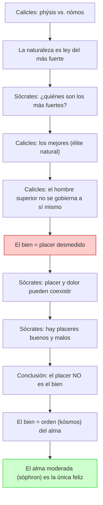

# 04 — Calicles: Naturaleza, Convención y Placer

> Tercer acto del diálogo (481b–522e): Sócrates vs. Calicles.
> Se examina la oposición entre naturaleza (*phýsis*) y convención (*nómos*),
> la identificación del bien con el placer, y la defensa socrática del alma ordenada.

---

## 🎬 Introducción: El interlocutor más radical

**Calicles** no es un sofista ni un retórico profesional. Es un **aristócrata ateniense ambicioso**, joven, educado, con aspiraciones políticas. Representa la tesis más extrema y peligrosa del diálogo.

A diferencia de Gorgias (que cree en la retórica como arte noble) y de Polo (que simplemente admira el poder), Calicles tiene una **visión del mundo articulada**:

- Desprecia la filosofía como cosa de jóvenes.
- Considera la moral convencional una venganza de los débiles.
- Defiende el derecho natural del más fuerte a dominar y poseer más.
- Identifica la vida buena con el placer y la ambición desmedida.

Calicles es, en muchos sentidos, el adversario más digno de Sócrates: no se deja refutar fácilmente y es **sincero** en su inmoralismo. Por eso su derrota dialéctica es también la más significativa.

---

## 🎯 Parte 1: *Phýsis* vs. *Nómos*

### La tesis de Calicles: la ley del más fuerte

Calicles introduce una distinción fundamental que recorre todo el pensamiento griego del siglo V a.C.:

| Concepto | Significado | Según Calicles |
|---|---|---|
| ***Phýsis*** (φύσις) | Naturaleza, orden real de las cosas | La naturaleza dicta que el más fuerte domine al más débil y posea más |
| ***Nómos*** (νόμος) | Convención, ley humana, costumbre | La ley es un invento de los débiles para protegerse de los fuertes |

**La tesis de Calicles en tres puntos:**

1. **La naturaleza es desigual:** los animales, las especies, los Estados — en todos lados el fuerte prevalece. Es la "ley natural".
2. **La moral es una venganza de los débiles:** las leyes que prohíben la ambición, que predican la moderación y la igualdad, fueron inventadas por la mayoría (los mediocres) para encadenar a los mejores.
3. **El ideal de vida:** el hombre superior (*kreítton*) debe dar rienda suelta a sus deseos y tener la capacidad de satisfacerlos. El placer, el poder y la ambición desmedida son la verdadera felicidad.

---

### La crítica de Calicles a la filosofía

Calicles no se limita a defender su tesis: **ataca directamente a Sócrates y a la filosofía**:

> «La filosofía es un entretenimiento elegante en la juventud, pero resulta ridícula y patética cuando se practica en la edad adulta.»

Sus argumentos contra la filosofía:
1. Los filósofos no conocen las leyes de la ciudad ni el lenguaje de los negocios.
2. No saben defenderse ante un tribunal.
3. Viven escondidos, "susurrando en un rincón con tres o cuatro muchachos".
4. Sócrates, a su edad, está desperdiciando la vida y se expone a ser condenado injustamente.

Este ataque es crucial: Calicles no solo tiene una posición teórica — está **advirtiendo a Sócrates** de su destino. Y Sócrates, como sabemos, fue efectivamente condenado a muerte.

---

### La respuesta de Sócrates: ¿quiénes son "los más fuertes"?

Sócrates contraataca con una pregunta aparentemente ingenua:

> **¿Quiénes son "los más fuertes"? ¿Uno solo o la mayoría?**

- Si "los más fuertes" es la **mayoría**, entonces las leyes que la mayoría impone son naturales (porque emanan de los más fuertes). En ese caso, obedecer la ley es obedecer a la naturaleza.
- Calicles se ve forzado a precisar: no la mayoría, sino **los mejores** (*beltistoi*), una élite natural: los más inteligentes y valientes.

Pero Sócrates no suelta la presa:
- Si los mejores deben gobernar, ¿deben también gobernarse a sí mismos?
- ¿Deben ser moderados (*sóphrones*) y dueños de sí mismos?
- Calicles responde que no: **el hombre superior no se gobierna a sí mismo**, da rienda suelta a sus deseos.

Aquí Calicles revela el núcleo de su posición: el ideal de vida es el **desenfreno**.

---

## 🎯 Parte 2: Lo agradable vs. lo bueno

### La identificación calicleana del bien con el placer

Calicles sostiene que **el bien es el placer** (*hedoné*). La vida buena es la vida de máximo placer: satisfacer todos los deseos, sin restricción.

### La refutación socrática

Sócrates demuestra que el placer y el bien **no son lo mismo** mediante varios argumentos:

#### Argumento 1: Placer y dolor simultáneos

- El hambriento que come siente **placer y dolor a la vez**: el hambre duele, comer place.
- Si el bien fuera el placer, el hambriento sería "bueno" y "malo" al mismo tiempo (porque siente placer y dolor simultáneamente).
- **Esto es absurdo.** Por tanto, el placer no es el bien.

#### Argumento 2: Placeres buenos y malos

- Hay placeres que son **buenos** (los del hombre moderado) y placeres que son **malos** (los del desenfreno).
- Si el placer fuera el bien, no podría haber placeres malos.
- Por tanto, el placer no es idéntico al bien.

#### Conclusión: el criterio del bien

> **Lo bueno es aquello con cuya presencia somos buenos.** La condición propia de cada cosa se encuentra en ella con perfección **por el orden** (*kósmos*).

No todo placer es bueno. Solo los placeres que contribuyen al orden del alma y del cuerpo son verdaderos bienes. **Se debe hacer lo agradable a causa de lo bueno, no al revés.**

---

## 🎯 Parte 3: El alma ordenada

### El orden (*kósmos*) como principio del bien

Sócrates despliega una visión positiva del alma:

| Alma desordenada | Alma ordenada |
|---|---|
| Injusta, insensata, desenfrenada | Justa, sabia, moderada |
| Incapaz de convivencia y amistad | Capaz de convivencia y amistad |
| No agrada ni a dioses ni a hombres | Agrada a dioses y a hombres |
| Es mala y desdichada | Es buena y feliz |

### El principio cósmico

Sócrates apela a una visión compartida por los "sabios" (probablemente pitagóricos):

> «Al cielo, a la tierra, a los dioses y a los hombres los gobiernan la **convivencia**, la **amistad**, el **buen orden**, la **moderación** y la **justicia**. Por eso llaman a este conjunto **cosmos** (*kósmos* = orden) y no desorden o desenfreno.»

El orden no es una imposición arbitraria: es la **estructura misma de la realidad**. El que vive desordenadamente no solo es malo — está en **contradicción con el universo**.

### La moderación (*sophrosyne*) como virtud fundamental

- El alma moderada (*sóphron*) es **buena**.
- El alma insensata y desenfrenada es **mala**.
- El hombre moderado obra con **justicia y piedad**, y es, por tanto, justo y piadoso.
- Una persona inmoderada no puede convivir, y sin convivencia no hay amistad.

---

## 📊 Esquema del enfrentamiento Sócrates-Calicles

---

## 🔑 Conceptos clave de esta sección

| Concepto | Definición |
|---|---|
| *Phýsis* (φύσις) | Naturaleza: orden real de las cosas, que según Calicles dicta el dominio del fuerte |
| *Nómos* (νόμος) | Convención, ley humana: según Calicles, invento de los débiles para igualar artificialmente |
| *Kreítton* (κρείττων) | El más fuerte/superior: el hombre que por naturaleza merece más poder y placer |
| *Hedoné* (ἡδονή) | Placer: Calicles lo identifica con el bien; Sócrates demuestra que son distintos |
| *Kósmos* (κόσμος) | Orden: el principio que hace buenas a las cosas; el alma buena es el alma ordenada |
| *Sophrosyne* (σωφροσύνη) | Moderación, templanza: la virtud del alma dueña de sí misma, opuesta al desenfreno |
| *Parrhesía* (παρρησία) | Hablar franco: Calicles la reclama como virtud; Sócrates la encarna de verdad |

---

## 📝 Conclusión parcial

El tercer acto marca el punto más alto de tensión en el diálogo:

1. Calicles defiende la tesis más extrema: la naturaleza como ley del más fuerte y el placer como bien supremo.
2. Sócrates demuestra que **el placer no es idéntico al bien**.
3. El bien es el **orden** (*kósmos*) del alma, que se manifiesta como **moderación** (*sophrosyne*).
4. El alma ordenada es la única capaz de convivencia, amistad y felicidad.

---

## ❓ Preguntas de repaso

1. ¿Qué distinción establece Calicles entre *phýsis* y *nómos*?
2. ¿Por qué, según Calicles, la moral es una "venganza de los mediocres"?
3. ¿Cuáles son los dos argumentos principales de Sócrates para refutar la identificación del bien con el placer?
4. ¿Qué significa *kósmos* y cómo se relaciona con el alma buena?
5. ¿Por qué la moderación (*sophrosyne*) es la virtud fundamental en esta parte del diálogo?

---

*Continúa en `05_socrates_politica_justicia_y_cuidado_del_alma.md` para la parte final.*
