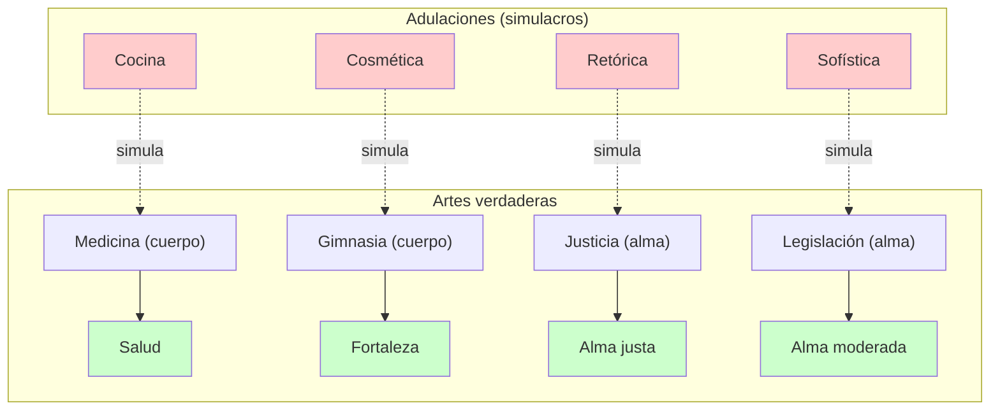

# 05 — Sócrates: Política, Justicia y Cuidado del Alma

> Culminación del diálogo (502d–527e): Sócrates expone su visión de la verdadera política,
> examina a los grandes gobernantes atenienses, se presenta como el único político auténtico,
> y cierra con el mito del juicio de las almas.

***

## 🎬 Introducción: El giro hacia la política

Tras refutar a Calicles sobre el placer y el bien, Sócrates da un giro decisivo: la discusión ya no es solo sobre la vida individual, sino sobre **la vida política**. ¿Qué tipo de gobernante necesita Atenas? ¿Qué es la verdadera política?

***

## 🎯 Parte 1: La verdadera política

### Dos procedimientos para el cuerpo y el alma

Sócrates establece una **analogía estructural** entre el cuidado del cuerpo y el cuidado del alma:

|                       | Cuerpo (*sôma*)                                        | Alma (*psyché*)                                                      |
| --------------------- | ------------------------------------------------------ | -------------------------------------------------------------------- |
| **Arte verdadero**    | Medicina (cura) + Gimnasia (fortalece)                 | **Justicia** (cura) + **Legislación** (fortalece)                    |
| **Adulación (falsa)** | Cocina (place sin nutrir) + Cosmética (aparenta salud) | **Retórica** (place sin educar) + **Sofística** (aparenta sabiduría) |

**La tesis:** Así como la cocina es una simulación de la medicina (da placer pero no salud), la retórica es una simulación de la justicia (da placer al pueblo pero no lo hace mejor).

***

### La actividad política debe apuntar al bien de los ciudadanos

> «La función del político es la **educación**, es el **servicio**. Los sofistas no tienen la idea de que exista un bien final a quien beneficiar.» (Notas de clase)

El criterio para juzgar a un gobernante no es cuántas naves construyó, cuántas murallas levantó o cuántas victorias obtuvo — sino:

> **¿Hizo mejores a los ciudadanos?**

Todo lo demás (puertos, arsenales, tributos) es **adulación política**: dar a la ciudad lo que desea, no lo que necesita.

***

## 🎯 Parte 2: El juicio sobre los gobernantes atenienses

### El caso de Pericles

Pericles (c. 495–429 a.C.) fue el estadista más célebre de la Atenas clásica. Sin embargo, Sócrates lo somete a un examen implacable:

* Al inicio de su gobierno, los atenienses no votaban contra él.
* Al final, **lo multaron y estuvieron a punto de condenarlo a muerte**.
* Si Pericles hubiera hecho mejores a los ciudadanos, estos no se habrían vuelto contra él.
* **Conclusión:** Pericles hizo a los atenienses más irritables, más injustos y peores. **No fue un verdadero gobernante.**

### El mismo criterio para todos

Sócrates extiende el mismo juicio a **Cimón, Temístocles y Milcíades** — los grandes nombres de la historia ateniense:

* Todos fueron hábiles en proveer a la ciudad lo que deseaba: naves, murallas, arsenales.
* Ninguno hizo a los ciudadanos **más justos**.
* Todos sufrieron el rechazo de la ciudad que gobernaron.

***

### La paradoja de los sofistas y gobernantes

Sócrates señala una contradicción flagrante:

> Los sofistas se quejan de que sus discípulos los tratan injustamente. Los gobernantes se quejan de que la ciudad los rechaza. Pero esto es absurdo: **nadie que gobierne bien una ciudad puede ser condenado por la misma ciudad que gobernó.**

Si un médico cura a un paciente y luego el paciente lo denuncia, algo falló en la cura. Si un gobernante hace justa a una ciudad y luego la ciudad lo condena, algo falló en el gobierno. **El rechazo de la ciudad es la prueba de que el gobernante no la hizo mejor.**

***

## 🎯 Parte 3: Sócrates como el único verdadero político

### La advertencia de Calicles y la respuesta de Sócrates

Calicles había advertido a Sócrates: si sigues con la filosofía, serás condenado injustamente y no podrás defenderte. Practica la política de la adulación y sobrevivirás.

**La respuesta de Sócrates es una de las declaraciones más radicales del diálogo:**

> «Creo que soy uno de los pocos atenienses, por no decir el único, que se dedica al **verdadero arte de la política.**»

Sócrates invierte completamente la acusación: **él es el político, no los políticos**. Porque:

* La política verdadera es el cuidado del alma (*epiméleia tês psychês*).
* Sócrates dedica su vida a examinar a los atenienses y hacerlos mejores.
* Los políticos profesionales solo han empeorado a los ciudadanos.

***

### ¿Por qué Sócrates no sabría defenderse ante un tribunal?

Sócrates reconoce que, efectivamente, no sabría defenderse ante un tribunal ateniense. Pero no por incompetencia — sino porque:

> «Como lo que digo no busca agradar sino hacer el bien, no sabría qué decir ante un tribunal que solo escucha adulación.»

Es como un médico juzgado por un tribunal de cocineros: haga lo que haga, será condenado, porque los jueces solo valoran lo agradable, no lo saludable.

***

### El problema de la parresía en los diálogos

Las notas de clase contienen una observación importante:

> «En los diálogos medios y los diálogos tardíos Platón tiene una doctrina mucho más segura, pero en los primeros diálogos no es tan elitista, como se puede ver en los diálogos aporéticos en el sentido de la *parresía*. El punto de partida del conocimiento es la ignorancia.»

Esto significa que el Sócrates del *Gorgias* no habla desde una doctrina ya cerrada (como el Sócrates de la *República*), sino desde la **ignorancia que interroga**. Su único saber es saber que no sabe — y desde ahí practica la verdadera política.

***

## 🎯 Parte 4: El mito final — el juicio de las almas

### Estructura del mito

Cuando Calicles abandona el diálogo, Sócrates narra un mito escatológico:

* Tras la muerte, las almas son **juzgadas desnudas** (sin cuerpo, sin riquezas, sin cargos públicos que las disfracen).
* En vida, las almas se "marcan" con las cicatrices de sus actos. Un alma justa es bella; un alma injusta está **cubierta de cicatrices y deformidades**.
* Los jueces (Minos, Radamantis y Éaco) examinan el alma tal cual es.
* Las almas justas van a las **Islas de los Bienaventurados**. Las almas injustas pero curables van al **Tártaro** para ser purificadas. Las almas **incurables** sirven de ejemplo eterno para las demás.

### La enseñanza del mito

El mito no es un adorno literario — es el **corolario necesario** de todo el diálogo:

1. **La muerte no es lo temible.** Lo temible es morir con el alma cargada de injusticias.
2. **El juicio es inapelable.** No hay retórica que valga ante los jueces del Hades: el alma se presenta desnuda, tal como es.
3. **El mito refuerza la tesis central:** Cometer injusticia es el mayor mal, y quien muere con el alma limpia no teme a la muerte.

> «Nadie teme a la muerte en sí misma, excepto el que es totalmente irracional y cobarde. Lo que sí se teme es **cometer injusticia**. El alma que va al Hades cargada de multitud de deudas sufre el más grave de todos los males.»

***

## 📊 Esquema de la verdadera y la falsa política

***

## 🔑 Conceptos clave

| Concepto                    | Definición                                                                                         |
| --------------------------- | -------------------------------------------------------------------------------------------------- |
| **Política verdadera**      | Cuidado del alma (*epiméleia tês psychês*) de los ciudadanos mediante la justicia y la legislación |
| **Política falsa**          | Adulación que provee placeres (naves, murallas, riquezas) sin hacer mejores a los ciudadanos       |
| **Criterio del gobernante** | ¿Hizo más justos a los ciudadanos? Si no, no fue un verdadero gobernante                           |
| **Sócrates como político**  | El único que practica la verdadera política al examinar y mejorar las almas                        |
| **Mito del juicio**         | Las almas son juzgadas desnudas; la justicia del alma determina el destino eterno                  |

***

## 📝 Conclusión parcial

El cierre del *Gorgias* es una de las cumbres de la filosofía platónica:

1. La verdadera política es el **cuidado del alma**, no la provisión de placeres.
2. Los grandes gobernantes atenienses **fracasaron** porque no hicieron mejores a los ciudadanos.
3. Sócrates es el **único verdadero político** de Atenas.
4. El **mito final** da un fundamento cósmico a la tesis del diálogo: la justicia no es una convención social, es la ley del universo.

***

## ❓ Preguntas de repaso

1. ¿Cuál es la analogía entre el cuidado del cuerpo y el cuidado del alma?
2. ¿Por qué, según Sócrates, Pericles no fue un verdadero gobernante?
3. ¿En qué sentido se presenta Sócrates como "el único verdadero político"?
4. ¿Qué función cumple el mito del juicio de las almas al final del diálogo?
5. ¿Por qué Sócrates no sabría defenderse ante un tribunal ateniense?

***

*Este archivo completa el análisis de los actos del diálogo. Continúa con `06_conceptos_clave.md` para una síntesis transversal.*