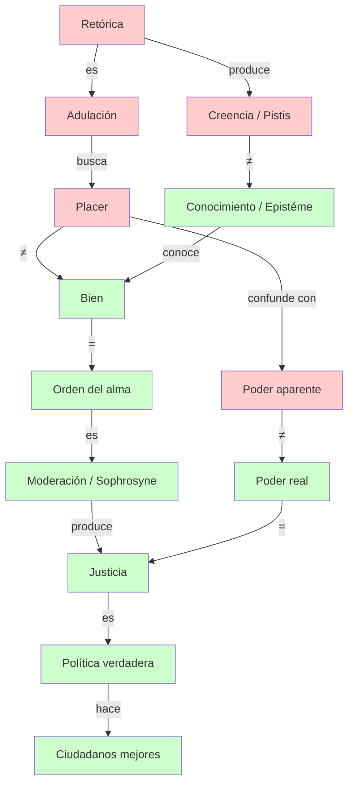

# 06 — Conceptos Clave del Gorgias

> Síntesis transversal de todos los conceptos filosóficos fundamentales que articulan el diálogo.
> Este archivo sirve como mapa de referencia rápida y como consolidación del vocabulario conceptual.

---

## 📑 Índice de conceptos

1. [Retórica y persuasión](#1-retórica-y-persuasión)
2. [Conocimiento y creencia](#2-conocimiento-y-creencia)
3. [Poder y tiranía](#3-poder-y-tiranía)
4. [Justicia e injusticia](#4-justicia-e-injusticia)
5. [Castigo y cura del alma](#5-castigo-y-cura-del-alma)
6. [Naturaleza y convención](#6-naturaleza-y-convención)
7. [Placer y bien](#7-placer-y-bien)
8. [Alma, orden y moderación](#8-alma-orden-y-moderación)
9. [Política verdadera y falsa](#9-política-verdadera-y-falsa)

---

## 1. Retórica y persuasión

### Definición socrática

La retórica, tal como la practican Gorgias y los sofistas, **no es un arte (*téchne*)** sino una **práctica de adulación (*kolakeía*)**. No transmite conocimiento, sino creencia. No busca el bien del alma, sino agradar al auditorio.

### Distinción fundamental

| Retórica (sofística) | Filosofía (socrática) |
|---|---|
| Persuade sin conocimiento | Enseña con conocimiento |
| Produce *pistis* (creencia) | Produce *epistéme* (saber) |
| Busca lo agradable | Busca lo bueno |
| Simula ser política | Es el verdadero cuidado del alma |

### Criterio de la *téchne*

Para que algo sea un arte verdadero debe:
1. Conocer la **naturaleza** de su objeto.
2. Poder **dar razón** (*lógon didónai*) de lo que hace.
3. Apuntar al **bien** de su objeto.

La retórica no cumple ninguno de estos tres criterios.

---

## 2. Conocimiento y creencia

### *Epistéme* (conocimiento)

- Saber fundamentado, capaz de dar cuenta racional de sí mismo.
- Propio de las artes verdaderas (medicina, matemáticas, filosofía).
- Quien conoce la justicia **no puede obrar injustamente** (principio socrático).

### *Pistis* (creencia)

- Persuasión que no se funda en el conocimiento de la verdad.
- Produce convicción sin entendimiento.
- Es el producto de la retórica y la adulación.

### Implicación política

Si la Asamblea se deja persuadir por oradores que no saben de lo que hablan, la democracia está gobernada por la **opinión**, no por el conocimiento.

---

## 3. Poder y tiranía

### La paradoja del poder

| Poder aparente | Poder real |
|---|---|
| Hacer lo que a uno le parece (*dokeîn*) | Hacer lo que uno quiere (*boúlesthai*) |
| Capacidad externa de actuar | Capacidad de hacer el bien |
| El tirano parece todopoderoso | El tirano es el más impotente |
| Ejemplo: Arquelao de Macedonia | Ejemplo: Sócrates |

### La distinción clave

- **Querer (*boúlesthai*):** desear el bien real, lo que verdaderamente nos conviene.
- **Parecer (*dokeîn*):** creer que algo es bueno sin serlo.

El tirano actúa según lo que le parece, pero **no hace lo que quiere**, porque nadie quiere el mal, y la injusticia es un mal.

---

## 4. Justicia e injusticia

### La tesis central del diálogo

> **Cometer injusticia es peor que sufrirla.**

### El argumento (tres pasos)

1. Cometer injusticia es más **feo** (*aíschion*) que sufrirla.
2. Lo feo lo es por ser **doloroso** o por ser **malo**.
3. Cometer injusticia no es más doloroso que sufrirla → por tanto, es **más malo**.
4. Lo más malo es lo más desdichado → **el injusto es más desdichado que su víctima**.

### Principio socrático

Quien conoce la justicia es justo y obra justamente. La injusticia es producto de la **ignorancia** del bien, no de una voluntad malvada.

---

## 5. Castigo y cura del alma

### La analogía médica

| Cuerpo | Alma |
|---|---|
| Enfermedad: desorden corporal | Injusticia: desorden del alma |
| Medicina: duele pero cura | Castigo (*díke*): duele pero purifica |
| Peor destino: enfermedad crónica sin tratar | Peor destino: injusticia sin castigo |

### El justo castigado es más feliz que el injusto impune

El castigo restaura el orden del alma. El que paga por su injusticia se **está curando**. El que escapa al castigo queda con el alma permanentemente enferma.

### El alma incurable

Hay almas que han cometido injusticias tan profundas que **no pueden ser curadas**. Son los tiranos y los criminales extremos. En el mito final, estas almas sirven de ejemplo eterno en el Hades.

---

## 6. Naturaleza y convención

### La distinción de Calicles

| *Phýsis* (naturaleza) | *Nómos* (convención/ley) |
|---|---|
| Orden real: el fuerte domina al débil | Invento de los débiles para igualar |
| Desigualdad natural | Igualdad artificial |
| El león, el águila, el imperio | Las leyes, la moral, la costumbre |

### La respuesta socrática

- ¿Quiénes son "los más fuertes"? Si es la mayoría, entonces la ley (que la mayoría impone) es natural.
- Calicles se ve forzado a precisar: los "mejores" (élite natural de inteligentes y valientes).
- Pero Sócrates demuestra que incluso los "mejores" necesitan **orden y moderación** para ser felices.

### Síntesis platónica

La verdadera *phýsis* del alma no es el desenfreno, sino el **orden**. La naturaleza del alma es ser **moderada y justa**. Calicles malinterpreta la naturaleza.

---

## 7. Placer y bien

### La tesis de Calicles

El bien es el placer (*hedoné*). La vida buena es la vida de máximo placer.

### La refutación socrática

1. **Placer y dolor simultáneos:** el hambriento que come siente placer y dolor a la vez. Si el bien = placer, sería bueno y malo al mismo tiempo. Absurdo.
2. **Placeres buenos y malos:** existen placeres que dañan (desenfreno) y placeres que benefician (moderación). Si placer = bien, no podría haber placeres malos.

### El criterio del bien

> **Lo bueno es aquello con cuya presencia somos buenos.**

El bien de una cosa es su **orden** (*kósmos*) propio. El bien del alma es la **justicia y la moderación**. Se debe hacer lo agradable a causa de lo bueno, no al revés.

---

## 8. Alma, orden y moderación

### El alma como totalidad ordenada

| Alma desordenada | Alma ordenada |
|---|---|
| Injusta, insensata, desenfrenada | Justa, sabia, moderada (*sóphron*) |
| Incapaz de convivencia | Capaz de amistad y comunidad |
| Es mala y desdichada | Es buena y feliz |

### *Kósmos* y *sophrosyne*

- **Kósmos:** el orden que hace que cada cosa sea buena. El universo es un *kósmos* porque está ordenado.
- **Sophrosyne:** la moderación, el dominio de sí mismo. Es la virtud del alma ordenada.

### El principio cósmico

Los sabios llaman al universo *kósmos* (orden) y no desorden. La convivencia, la amistad, el buen orden, la moderación y la justicia gobiernan el cielo, la tierra, los dioses y los hombres.

---

## 9. Política verdadera y falsa

### Dos modos de gobernar

| Política verdadera | Política falsa (adulación) |
|---|---|
| Apunta al bien del alma | Apunta al placer del pueblo |
| Hace **mejores** a los ciudadanos | Hace **más dóciles** a los ciudadanos |
| Criterio: justicia | Criterio: popularidad |
| Sócrates como modelo | Pericles, Temístocles, Cimón |

### El criterio del gobernante

> **¿Hizo más justos a los ciudadanos?**

Si los ciudadanos se vuelven contra el gobernante, es la **prueba** de que el gobernante no los hizo mejores. Ningún verdadero gobernante puede ser condenado por la ciudad que gobernó.

### Sócrates como político

Sócrates se declara el único verdadero político de Atenas porque dedica su vida a **examinar y mejorar las almas** de sus conciudadanos, no a proveerles placeres.

---

## 🌐 Mapa de interconexiones conceptuales

---

## 📝 Conclusión

El *Gorgias* articula un entramado conceptual en el que todos los conceptos se implican mutuamente:

- La **retórica** es adulación porque no busca el bien sino el placer.
- El **placer** no es el bien; el bien es el **orden**.
- El **alma ordenada** es moderada y justa.
- La **justicia** es la salud del alma.
- El **castigo** es la medicina que la restaura.
- La **política verdadera** es el cuidado del alma de los ciudadanos.
- El **poder real** es la capacidad de hacer el bien.

Todo el diálogo converge en una tesis: **cometer injusticia es el mayor mal, y solo el justo es feliz.**

---

*Continúa en `07_mapas_y_diagramas.md` para visualizar estas conexiones.*
